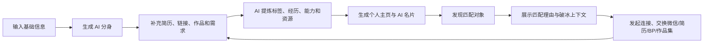

# LiveLink

LiveLink 是一个 AI 驱动的价值社交工具，帮助用户快速生成自己的「数字分身 / AI 名片」，并基于个人能力、经历、资源和需求，智能发现并链接合适的人。

它关注的不是泛社交，而是高价值找人：找队友、找投资人、找创业者、找人才、找资源。


## 一句话定位

把零散的个人信息、简历、项目经历和公开主页，整理成可展示、可搜索、可推荐、可破冰的 AI 分身。

## 核心场景

| 场景 | 用户想完成什么 | LiveLink 提供什么 |
| --- | --- | --- |
| 找队友 | 找到能力互补、目标一致的人 | 根据能力、项目、需求和风格推荐匹配对象 |
| 找投资人 | 更快说明自己是谁、在做什么 | 用 AI 名片和结构化主页降低自我介绍成本 |
| 找创业者 | 发现值得交流的建设者 | 展示匹配理由、共同话题和破冰上下文 |
| 找人才 | 从标签和经历里快速判断价值 | 聚合项目、能力、资源优势和当前需求 |
| 找资源 | 找到可交换、可合作的连接 | 让「我能提供」和「我想寻找」被系统理解 |

## 产品闭环



## 核心流程

### 1. 生成我的 AI 分身

用户通过手机号、姓名、职业身份、自我介绍、简历、GitHub、小红书、作品集等信息，快速生成一个结构化个人主页。

即使只填写基础信息，也可以先生成一个最小版名片，降低首次进入门槛。

### 2. 完善与进化分身

AI 会从用户输入中提炼：

- 个人标签
- 经历亮点
- 核心能力
- 可提供资源
- 当前需求
- 个人风格
- 社交价值

用户可以持续补充、修改和调优，让 AI 分身越来越接近真实的自己。

### 3. 发现匹配对象

系统根据用户的目标和画像，在平台内或公开信息中推荐匹配的人。

推荐不只给出人选，还会解释「为什么这个人适合你」。

### 4. 发起链接

用户可以向目标对象发起连接请求，并按场景分享：

- AI 名片
- 微信名片
- 简历
- BP
- 作品集
- 破冰消息

如果目标对象已有 AI 分身，可先完成 A-to-A 预沟通，再由真人接入决策。

## 页面结构

| 页面 | 作用 | 关键体验 |
| --- | --- | --- |
| 首页 / 生成页 | 低门槛进入产品 | 填写手机号、姓名、职业等基础信息，快速生成最小版 AI 分身 |
| 信息补充页 | 让分身更精准 | 上传简历、填写介绍、绑定社交媒体、输入项目经历和当前需求 |
| AI 对话引导 | 降低录入成本 | 通过对话式问题补充经历、能力、资源和需求 |
| 个人主页页 | 展示 AI 名片 | 呈现基本信息、身份标签、能力、项目、资源、需求、AI 洞察和个人风格 |
| 分享海报页 | 方便传播裂变 | 自动生成适合微信、小红书等渠道的个人海报，带二维码或个人链接 |
| 发现市场页 | 找到合适的人 | 展示推荐对象卡片，包括头像、身份、标签、匹配度和推荐理由 |
| 链接对话页 | 完成破冰 | 查看 AI 生成的破冰上下文，发送连接请求或交换资料 |

## 关键交互逻辑

- 用户信息越完整，AI 分身越精准，匹配效果越好。
- 基础信息可以生成简版名片；想获得精准推荐，需要继续「进化」自己的分身。
- AI 将零散输入转化成结构化内容，降低写简历、自我介绍和社交名片的成本。
- 发现别人时，系统必须解释匹配原因，而不只是给出名单。
- 如果目标对象还不是用户，可以生成公开信息版卡片，并引导用户通过社交媒体留言、分享名片等方式建立连接。
- 整个产品既服务于「我是谁」的展示，也服务于「我要找谁」的精准链接。

## 技术栈

| 模块 | 技术 |
| --- | --- |
| Web 框架 | Next.js 15, React 19 |
| 数据库 | PostgreSQL |
| ORM | Prisma |
| AI 接入 | OpenAI-compatible API |
| 文档解析 | mammoth, pdf-parse |
| 测试 | Vitest |
| 语言 | TypeScript |

## 本地运行

```bash
npm install
cp .env.example .env
npm run db:generate
npm run db:migrate
npm run dev
```

启动后访问：

```text
http://localhost:3000
```

## 环境变量

| 变量 | 说明 |
| --- | --- |
| `DATABASE_URL` | PostgreSQL 连接地址 |
| `AI_API_KEY` | AI 服务密钥 |
| `AI_BASE_URL` | OpenAI-compatible API 地址 |
| `AI_MODEL` | 使用的模型名称 |
| `AI_WIRE_API` | AI 请求协议 |
| `NEXT_PUBLIC_APP_URL` | 前端公开访问地址 |

## 项目文档

- [项目计划](./docs/project-plan.md)
- [技术设计](./docs/technical-design.md)
- [实现计划](./docs/implementation-plan.md)
- [部署说明](./docs/vercel-deployment.md)

## 当前方向

LiveLink 的目标不是做一张静态名片，而是沉淀一个可持续进化的个人价值资产。

每一次补充资料、每一次匹配反馈、每一次连接请求，都会让 AI 分身更理解「我是谁」以及「我应该认识谁」。
